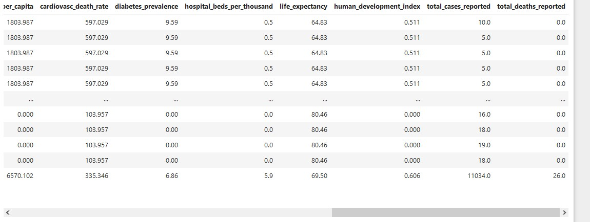
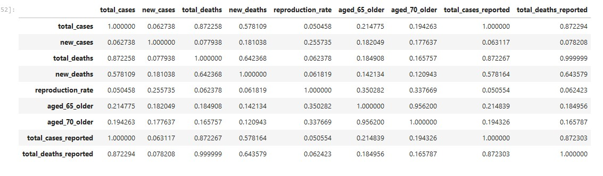
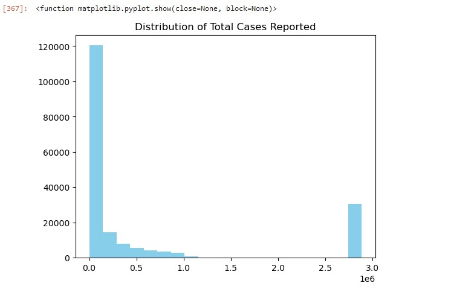
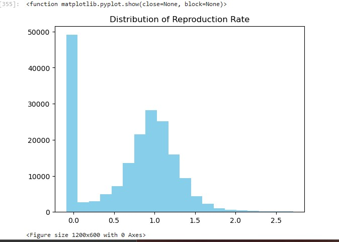
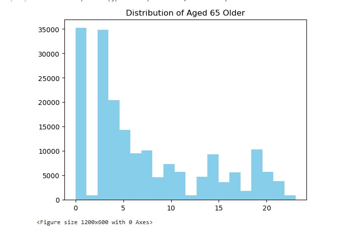
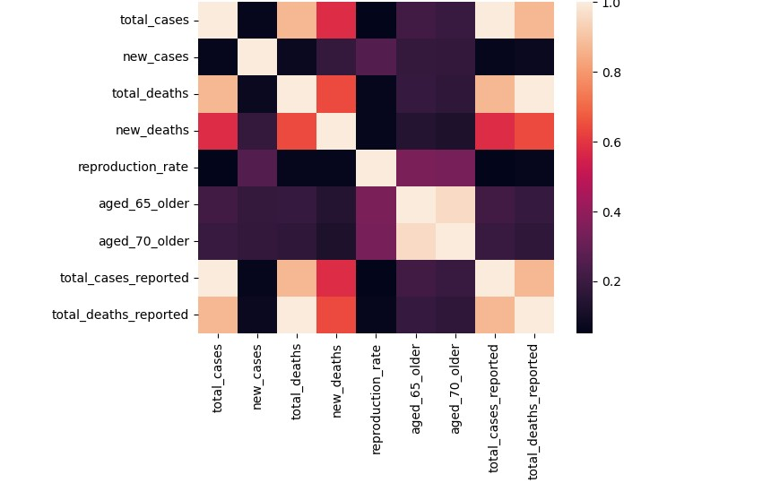
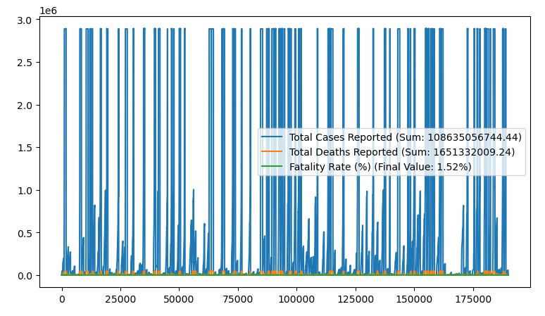
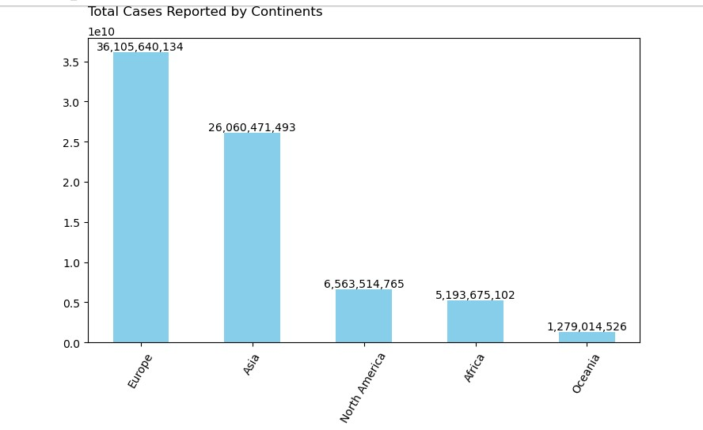
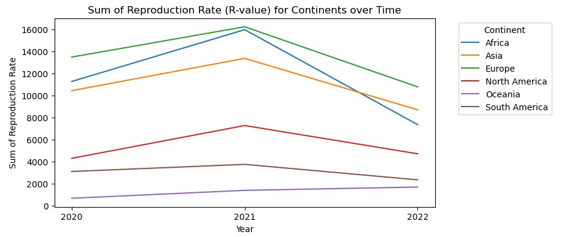
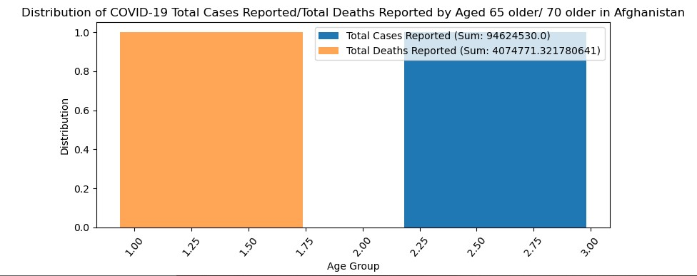

### **Epidemic-Insights**

## **Epidemic Insights: Uncovering COVID-19 Trends**

## Introduction

This is a project that explores the trends and patterns of the COVID-19 pandemic. It analyzes data to understand how the virus has spread over time and in different places. By doing this, we aim to learn more about the pandemic's development, what influences its spread, and how we can manage it better in the future. Join us as we dig into the data to find the stories behind the numbers and to understand this global health crisis better.

## **Objective**
---

* Understand the distribution of numerical values and check for correlations between relevant variables.

* Understand distribution of the numerical values.

* Check for correlations between relevant variables (Numerical vs Numerical).
            

## **Problem Statement**
---

- Generate relevant KPIs or metrics regarding the dataset.
        Key Tasks:
            Calculate total cases reported.
            Calculate total deaths.
            Calculate Case Fatality Rate (CFR): Percentage of confirmed COVID-19 cases that result in death, and so on.

- Show how the total number of COVID-19 cases vary over different continents, illustrating at least the top 5 continents with the highest COVID cases.

- Identify countries that have experienced significant fluctuations in the reproduction rate (R-value) of COVID-19 transmission.

- Analyze the distribution of COVID-19 cases and deaths among different age groups, and how it varies across countries.

## **Data Source**
---
  
CSV file

## **Tools and Techniques:**
---

  *  Python: Used for data cleaning, analysis, and visualization.
    
  *  pandas: Used for data manipulation and analysis.
    
  *  matplotlib.pyplot: Used for creating visualizations.
    
  *  seaborn: Used for statistical data visualization.
    
  *  numpy: Used for numerical computing.
    
  *  Jupyter Notebook: Used as the development environment for the analysis.

## **Data Cleaning and Processing**
---

**1.  import a CSV file named 'covid-data.csv' using pd.read_csv() into a DataFrame named Cvd_data.**

**2.  Data assessment: are crucial for understanding the quality and characteristics of my dataset.**
   
   Here are steps used to approach it using Python and pandas:
   
  *  Null Values: Cvd_data.isnull().sum()
    
  *  Duplicates: Cvd_data.duplicated().sum()
    
  *  Incorrect Datatypes: Cvd_data.dtypes
    
  *  Incorrect Date Entries: Cvd_data['date']
    
  *  Mispellings: Cvd_data['continent'].value_counts('all'), Cvd_data['location'].value_counts('all')
    
  *  Outliers: Using boxplot - Cvd_data.plot()
    

**3.  Data cleaning methods: Preparing my data for analysis**
   
  *  Handling Null Values:
    
Cvd_data['continent'].fillna('unknown, inplace = True')

Cvd_data['continent'].isnull().sum()
     
**The first line of code is to fill missing values in the 'continent' column with the string 'unknown'. The second line is used to check if there are any remaining null         values in the column after filling them with 'unknown'.**
     
  *  Handling Duplicates: There is no duplicate values in the dataset
    
  *  Handling Incorrect Datatype:

Cvd_data['tests_units'].str.contains('\D').sum()
                                 
Cvd_data[Cvd_data['tests_units'].str.contains('\D', na = False)]['tests_units']
                                  
Cvd_data['tests_units'] = pd.to_numeric(Cvd_data['tests_units'], errors = 'coerce')
                                  
Cvd_data['tests_units']
     
**first line of the code is used to count the number of values in the 'tests_units' that contain a 'str' (non-digit) character. the second line  filters the 'str' character. the next line converts the 'tests_units' column to 'int' (numeric) values. and the last line is then used to display the 'tests_units' column after the conversion, showing the updated numeric values or NaN for values that could not be converted.**
     
  
  *   Handling Incorrect Date Entries:

Cvd_data['date'] = pd.to_datetime(Cvd_data['date'], format='%d-%m-%Y')
Cvd_data['date']
      
**This code converts the 'date' column to datetime format function.**
  
  *   Handling Ouliers:
    
median_values = Cvd_data[['new_cases',  'aged_65_older', 'aged_70_older', 'reproduction_rate']].median()

Q1 = Cvd_data[['new_cases',  'aged_65_older', 'aged_70_older', 'reproduction_rate']].quantile(0.25)

Q3 = Cvd_data[['new_cases',  'aged_65_older', 'aged_70_older', 'reproduction_rate']].quantile(0.75)

IQR = Q3 - Q1

lower_bounds = Q1 - 1.5 * IQR

upper_bounds = Q3 + 1.5 * IQR

def replace_outliers_with_median(col):

lower_bound = Q1.loc[col.name] - 1.5 * IQR.loc[col.name]

upper_bound = Q3.loc[col.name] + 1.5 * IQR.loc[col.name]
    
return col.mask((col < lower_bound) | (col > upper_bound), median_values.loc[col.name])
    
Cvd_data[['new_cases',  'aged_65_older', 'aged_70_older', 'reproduction_rate']] = Cvd_data[['new_cases',  'aged_65_older', 'aged_70_older', 'reproduction_rate']].apply(replace_outliers_with_median)

print(Cvd_data.head(11))

**This codes calculates the median, interquartile range (IQR), and lower and upper bounds for outliers for the columns "'new_cases', 'aged_65_older', 'aged_70_older', and 
'reproduction_rate'". And then defines a function to replace outliers with the median value for each column and applies this function to replace outliers in the specified columns. Finally, it displays the first 11 rows of the data after replacing outliers.**

mean_values = Cvd_data[['total_cases', 'total_deaths', 'new_deaths',]].mean()

Q1 = Cvd_data[['total_cases', 'total_deaths', 'new_deaths',]].quantile(0.25)

Q3 = Cvd_data[['total_cases', 'total_deaths', 'new_deaths',]].quantile(0.75)

IQR = Q3 - Q1

lower_bounds = Q1 - 1.5 * IQR

upper_bounds = Q3 + 1.5 * IQR

def replace_outliers_with_mean(col):

lower_bound = lower_bounds[col.name]

upper_bound = upper_bounds[col.name]
    
return col.mask((col < lower_bound) | (col > upper_bound), mean_values[col.name])
    
Cvd_data[['total_cases', 'total_deaths', 'new_deaths',]] = Cvd_data[['total_cases', 'total_deaths', 'new_deaths',]].apply(replace_outliers_with_mean, axis=0)

print(Cvd_data.head(11))

**This calculates the mean, interquartile range (IQR), and lower and upper bounds for outliers for the columns "''total_cases', 'total_deaths', 'new_deaths'". And then defines a function to replace outliers with the mean value for each column and applies this function to replace outliers in the specified columns. Finally, it displays the first 11 rows of the data after replacing outliers.**

## **Exploratory Data Analysis**
---

*    **Feature Engineering:**
     
Cvd_data['total_cases_reported'] = Cvd_data['total_cases'] + Cvd_data['new_cases']

Cvd_data['total_deaths_reported'] = Cvd_data['total_deaths'] + Cvd_data['new_deaths']

Cvd_data

*These lines of code are performing calculations to create two new columns 'total_cases_reported and 'total_deaths_reported' by adding the 'total_cases' with 'new_cases', and 'total_deaths' with 'new_deaths' in the DataFrame*

*    **Numerical Correlation:**

Distr = Cvd_data.select_dtypes(['int', 'float']).iloc[:, [0, 1, 3, 4, 9, 22, 23, 30, 31]].corr()

Distr

*This code calculates the correlation matrix for type 'int' or 'float'.*

Here are few observations from the matrix:

- total_cases vs. new_cases: There is a very weak positive correlation (0.062738), indicating that as the total cases increase, there is a slight increase in new cases.

- total_cases vs. total_deaths: There is a strong positive correlation (0.872258), indicating that as the total cases increase, there is a strong tendency for total deaths to also increase.

- new_cases vs. new_deaths: There is a moderate positive correlation (0.181038), indicating that as new cases increase, there is a moderate increase in new deaths.

- reproduction_rate vs. aged_65_older: There is a moderate positive correlation (0.350282), indicating that countries with a higher percentage of aged 65 or older tend to have a slightly higher reproduction rate.

* **Numerical Distribution:**

plt.hist(Cvd_data['total_cases_reported'], color = 'skyblue', bins = (20))

plt.title('Distribution of Total Cases Reported')

plt.figure(figsize = (12, 6))
                           
plt.show
 
**The code plots a histogram of the 'total_cases_reported'.**

 
 

## **Correlations betwen relevant variables (Numerial Vs Numerical)**

Distr = Cvd_data.select_dtypes(['int', 'float']).iloc[:, [0, 1, 3, 4, 9, 22, 23, 30, 31]].corr()

sns.heatmap(Distr)

**This code uses Seaborn's heatmap function to visualize the correlation matrix Distr as a heatmap.**

**## Statement 1**
---

The provided data gives an overview of the total reported COVID-19 cases and deaths, along with the calculated case fatality rate (CFR) as a percentage. These metrics are crucial for understanding the impact of the pandemic on a global scale.   

- Total Cases Reported: 108,635,056,744.44

- Total Deaths Reported: 1,651,332,009.24

- Fatality Rate (%): 1.52%

These numbers represent the cumulative count of confirmed COVID-19 cases and deaths reported worldwide. They reflect the magnitude of the pandemic's spread and its toll on human lives. The case fatality rate is the percentage of confirmed COVID-19 cases that result in death. A CFR of 1.52% indicates on average, about 1.52% of people diagnosed with COVID-19 have died from the disease.

## **Problem Statement 2**
---

## **Problem Statement 3**
---

**Insights from the Analysis:**

2020: Europe had the highest reproduction rate (13477.41), followed by Africa (11262.41) and Asia (10426.78).
2021: Europe maintained the highest reproduction rate (16228.19), followed by Asia (13358.17) and Africa (15966.37).
2022: Europe continued to lead with a reproduction rate of 10770.09, followed by Asia (8688.47) and Africa (7343.79).

**Trend Analysis:**
        
Europe consistently had the highest reproduction rate across all three years, indicating a persistent challenge in controlling the spread of COVID-19 in the region.
Asia and Africa also experienced high reproduction rates, suggesting ongoing transmission and the need for continued public health interventions.

## **Problem Statement 4**
---

## **Conclusion and Recommendations**
---

In conclusion, our analysis has provided valuable insights into the trends and patterns of the COVID-19 pandemic, highlighting the following key findings:

- There is a strong positive correlation between total cases and total deaths, indicating the need for effective measures to reduce the number of new cases and total cases to   minimize deaths.
  
- The correlation between new cases and new deaths underscores the importance of prompt detection and treatment to reduce the mortality rate associated with COVID-19.

- Countries with higher percentages of elderly populations face increased risks, emphasizing the need for targeted measures to protect this vulnerable group.

- The analysis also revealed variations in the reproduction rate of COVID-19 across different continents and years. The reproduction rate, which indicates the average number    of secondary infections caused by an infected individual, showed fluctuations over time and across regions.

  For example:

  In 2020, Europe had the highest reproduction rate, followed by Asia and Africa.

  In 2021, Europe maintained the highest reproduction rate, with Asia and Africa also showing significant rates.

  In 2022, Europe continued to have a high reproduction rate, but there was a noticeable decrease compared to the previous year.

**Based on these findings, I recommend the following actions:**
    
- Prioritize vaccination efforts to protect vulnerable populations and reduce the overall impact of the pandemic.

- Implement strict public health measures to reduce the spread of the virus, especially in regions with high transmission rates.

- Enhance data collection and reporting to improve the accuracy and timeliness of information on COVID-19 cases and deaths.

- Continue monitoring and analyzing data to identify emerging trends and adapt strategies accordingly.
